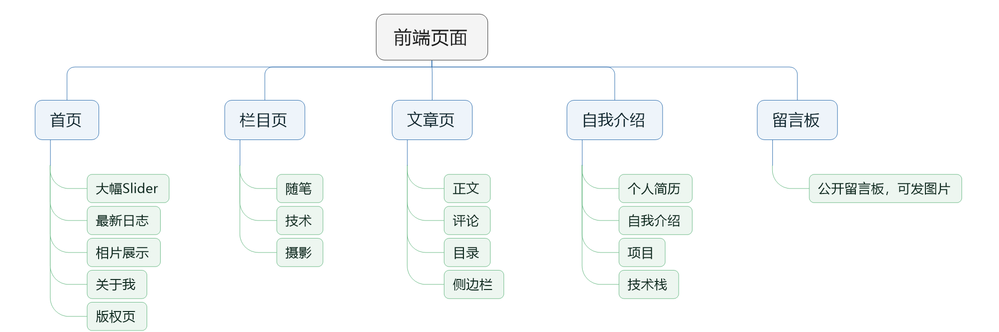
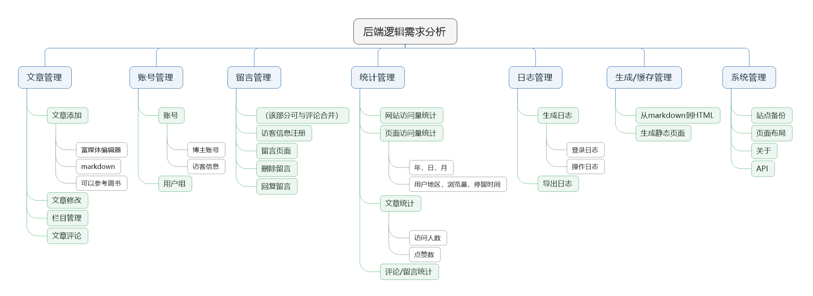
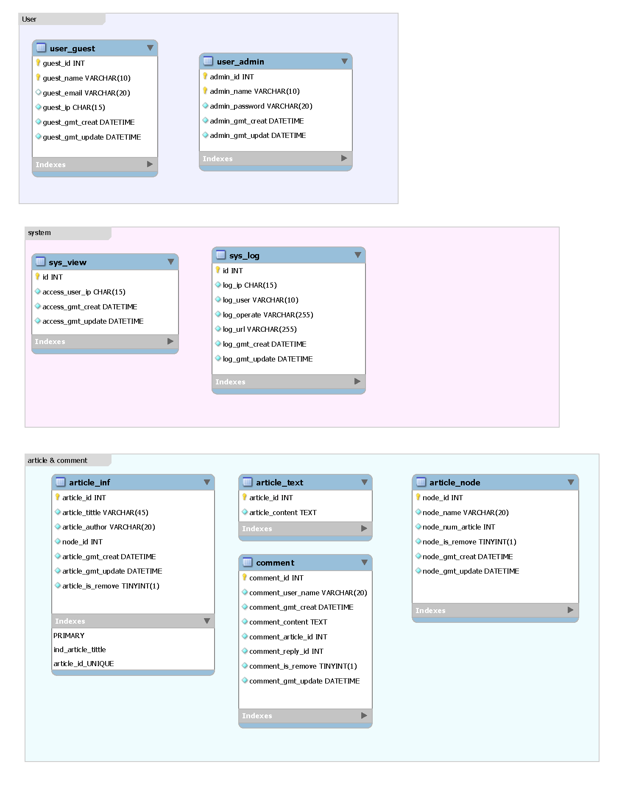

#个人博客开发项目开发日志

>参考文档：
SpringBoot技术栈搭建个人博客【项目准备】：https://www.jianshu.com/p/0293368fe750
SpringBoot技术栈搭建个人博客【后台开发】：https://www.jianshu.com/p/91c6c9fc67c4
SpringBoot技术栈搭建个人博客【前台开发/项目总结】：https://www.jianshu.com/p/c66541e59249

>参考博客：
https://www.dandyweng.com/
http://www.syg315.com/
http://kenjiendo.com/

>参考网站：
https://www.greenhoper.com/

>参考书目：
《阿里巴巴Java开发手册》
《深入分析Java  Web技术内幕》
《Java 语言程序设计》

#目录
[TOC]
#项目准备
>把能想到需求的都写出来，根据自己的能力再进行删减，最后完成整个项目。
##需求分析
###前端需求分析

####总体
前端部分是整个网页的门户，要在兼顾我个人实力的情况下把网页实现的尽可能的漂亮，简洁。我想我第一版的个人博客不会去追求很华丽的特效，或者是很酷炫的代码，也许可能直接用之前有所接触的bootstrap框架速成一个，也可能自己做，自己修改，这个嘛……到时候真正有需求的是时候再说吧~
####首页
首页与预计采用通栏是设计。（参考翁天信、青朴的设计）
- 大幅的Slider：展示个人的摄影作品用
- 第一个通栏：最新文章，展示一个最近发布的博文
- 第二个通栏：展示照片，以影集的形式
- 第三个通栏：自我介绍，联系方式
- 第四个通栏：版权页，留言板的输入框
####栏目页
栏目页，还没有想好做不做，但是如果做的话将分为以下几个栏目：
- 随笔：就是想起什么写什么……内容不限，可以是的心灵鸡汤，可以是化学方向的劝退文，也可以是读书笔记或者是最近的一些反思
- 技术：这是网站的主要内容——发布技术博客，会放所有的技术文章在我的网站上。因为我大部分技术文档是用markdwon实现的，因此，后台的的富媒体要支持markdwon（刚需）
- 摄影：还可以放一些最近拍摄的照片~
####文章页
文章页，就是具体的文章页了……没什么好说的
- 评论：我觉得有必要加评论（虽然可能没什么人看……但是至少要加上
- 目录：因为绝大多数文档都是用markdown写成，所以还是需要目录为读者导航，放在侧边栏（可能会被砍掉，换成文章的栏目页）
- 正文：就是正文

####自我介绍
自我介绍可能设计成一个栏目页，分为以下几个板块
- 个人简历：把之前的个人简历上面的敏感信息打上马赛克（可能吧）之后做成一个单独的栏目页上传，方便HR联系
- 自我介绍：一个很随意的自我介绍（简历偏向官方）
- 项目和技术栈：做过的项目，和已经积累的技术栈，用思维导图和形式呈现出来，项目带上Github连接

###后端需求分析

分析hopeCMS的后端功能，再尝试进行实现

###数据库需求分析

##项目管理

##项目搭建

